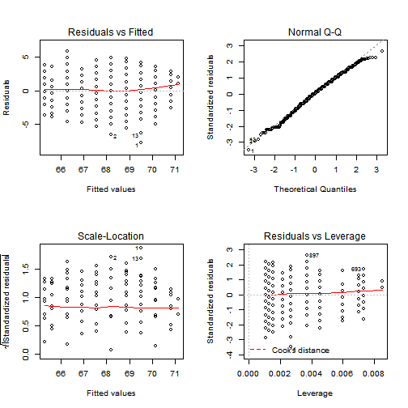

---
title       : Child Height Prediction
subtitle    : Developing Data Products Course Project
author      : 
job         : 
framework   : io2012        # {io2012, html5slides, shower, dzslides, ...}
highlighter : highlight.js  # {highlight.js, prettify, highlight}
hitheme     : tomorrow      # 
widgets     : []            # {mathjax, quiz, bootstrap}
mode        : selfcontained # {standalone, draft}
---page 2
## Data Set

This preditcion algorithm uses galton data set in the library UsingR. 

```r
library(UsingR)
summary(galton)
```

```
##      child          parent    
##  Min.   :61.7   Min.   :64.0  
##  1st Qu.:66.2   1st Qu.:67.5  
##  Median :68.2   Median :68.5  
##  Mean   :68.1   Mean   :68.3  
##  3rd Qu.:70.2   3rd Qu.:69.5  
##  Max.   :73.7   Max.   :73.0
```


---page 3
## Build the model

A linear regression model is fit to the data.

```r
fit <- lm(child ~ parent, data = galton)
summary(fit)
```

```
## 
## Call:
## lm(formula = child ~ parent, data = galton)
## 
## Residuals:
##    Min     1Q Median     3Q    Max 
## -7.805 -1.366  0.049  1.634  5.926 
## 
## Coefficients:
##             Estimate Std. Error t value Pr(>|t|)    
## (Intercept)  23.9415     2.8109    8.52   <2e-16 ***
## parent        0.6463     0.0411   15.71   <2e-16 ***
## ---
## Signif. codes:  0 '***' 0.001 '**' 0.01 '*' 0.05 '.' 0.1 ' ' 1
## 
## Residual standard error: 2.24 on 926 degrees of freedom
## Multiple R-squared:  0.21,	Adjusted R-squared:  0.21 
## F-statistic:  247 on 1 and 926 DF,  p-value: <2e-16
```


---page 4
## Prediction

The prediction model takes father height and mother height as input and convert them to parent height. Then parent height is used to predict child height.
As the used data set has parent height range from 64 to 73, the prediction works when parent height is within that range.


```r
ChildHeight <- function(father, mother) {
    as.vector(predict(fit, data.frame(parent = mean(c(father, 1.08 * mother)))))
}
```


---page 5
## Residual plot and model diagnose


```r
par(mfrow = c(2, 2))
plot(fit)
```

 


